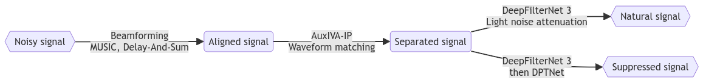

# Oticon Audio Explorers 2024 
### Team Wavefront's submission for the software challenge/category



## Abstract
The 2024 Oticon Audio Explorers (Software Challenge) provides a 32-channel, 30 second audio clip of a speaker masked by loud background noise. 4-channels are chosen via an exhaustive analysis of speaker direction and a search with the conclusion that the **4 microphones closest to the speaker** were best. The mixture signal from the chosen microphones are beamformed via **MUSIC** and **Delay-And-Sum**, and then the speech is separated via **Auxiliary Independent Vector Analysis with Iterative Projection**. Finally the speech is enhanced via **DeepFilterNet 3** and **DPTNet** to yield two audio clips: **A heavily suppressed clip with low noise**, and **a "natural" sounding clip**. Every part of the processing pipeline (currently offline processing) has been chosen to be performant enough to be rewritten to support **real-time processing** of an audio signal. This latter part not been implemented, because of the time constraints posed by the Oticon Audio Explorers challenge.

# Repository
This repository contains the submission code for the accompanying report and two audio files. The following is guidance on how to interact with the repository.

## Installation for development
Choose __**ONE**__ of the following:
- Open the provided devcontainer in your IDE (best experience & recommended for GPU users).
- With Python 3.11, run `pip install -e .[dev]` (recommended for CPU users)


## Enhancing an audio file
Provide an input directory full of audio files with 32 channels. The microphone used is assumed to be the `mh acoustics em32 Eigenmike`. The output is stored in the specified output directory, where each input file will yield three files. These files are from various stages in the processing pipeline, which can be seen at the top of this `README.md`.
```bash
python -m modelling.enhance --input_dir=data/raw --output_dir=output
```

## Evaluation  
To evaluate the method, first create a dataset by the description below.

When a dataset is created, simply run 
```
python -m modelling.evaluate
```
Note that you may have to change the data directiory in the module.

## Data generation

### Calculating positions
To extract the positions of the microphones to a numpy array, run the following command:
```python
python -m modelling.utils.export_mic_pos
```
The command will create `mic_pos.npy` in `data/`.
The numpy file is a 32x3 np.ndarray with the shape: `n_mics X 3`.
The microphone positions are centered around the origin with `cm` as its unit.

### Calculating custom dataset

To create your own dataset for validation / and future pretraining of models first download the DNS-4 dataset from:

* Unix: Use the provided scripts from: https://github.com/microsoft/DNS-Challenge
* Windows: Use the ported ``src/modelling/data/utils/download_dns4data.bat`` to download the data.

In both cases, either Unix or Windows, choose the desired files from the list and run the script.

**Generating data**  
To generate a dataset, simple run:

```
python modelling/data/generate_data.py
```

Note that you may have to change the directories in the Config
class (in the same script).
